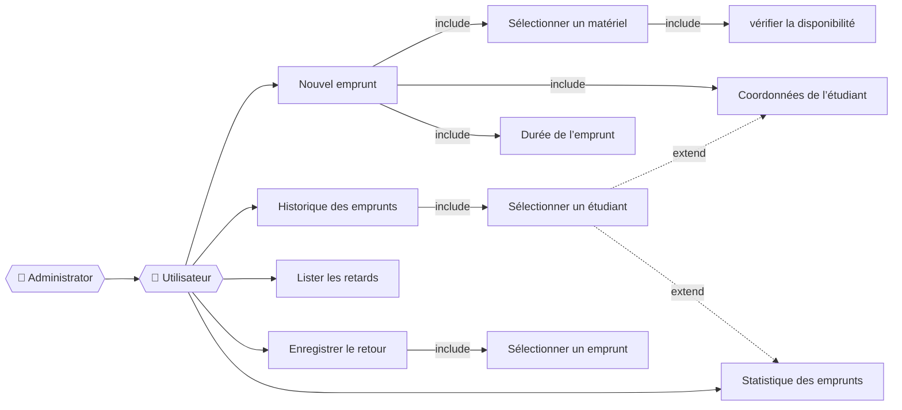
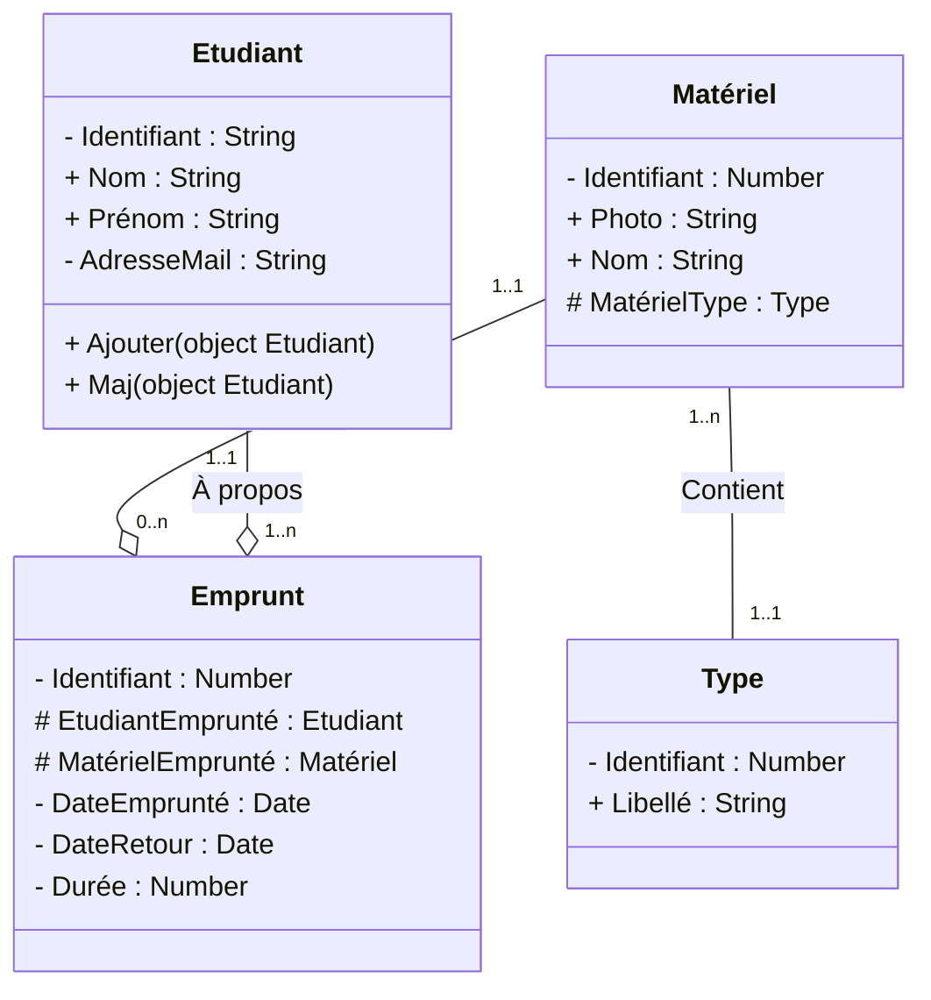

## cas d'utilisation

```mermaid
graph LR
  Administrator{{"👤 Administrator"}} --> Utilisateur{{"👤 Utilisateur"}}
  Utilisateur --> NouvelEmprunt["Nouvel emprunt"]
  NouvelEmprunt --> |include| Matériel["Sélectionner un matériel"]
  NouvelEmprunt --> |include| Coordonnées["Coordonnées de l’étudiant"]
  NouvelEmprunt --> |include| Durée["Durée de l’emprunt"]
  Utilisateur --> Historique["Historique des emprunts"]
  Historique --> |include| Etudiant["Sélectionner un étudiant"]
  Etudiant -.-> |extend| Coordonnées
  Utilisateur --> Retards["Lister les retards"]
  Utilisateur --> Retour["Enregistrer le retour"]
  Retour --> |include| Emprunt["Sélectionner un emprunt"]
  Matériel --> |include| Disponibilité["vérifier la disponibilité"]
  Utilisateur --> Statistique["Statistique des emprunts"]
  Etudiant -.-> |extend| Statistique
```
## classes

```mermaid
classDiagram
    class Etudiant {
        - Identifiant : String
        + Nom : String
        + Prénom : String
        - AdresseMail : String
        + Ajouter(object Etudiant)
        + Maj(object Etudiant)
    }
    class Type {
        - Identifiant : Number
        + Libellé : String
    }
    class Matériel {
        - Identifiant : Number
        + Photo : String
        + Nom : String
        # MatérielType : Type
    }
    class Emprunt {
        - Identifiant : Number
        # EtudiantEmprunté : Etudiant
        # MatérielEmprunté : Matériel
        - DateEmprunté : Date
        - DateRetour : Date
        - Durée : Number
    }
    
    Matériel "1..n" -- "1..1" Type : Contient
    Matériel "1..1" --o "0..n" Emprunt : À propos
    Etudiant "1..1" --o "1..n" Emprunt : À propos
```
