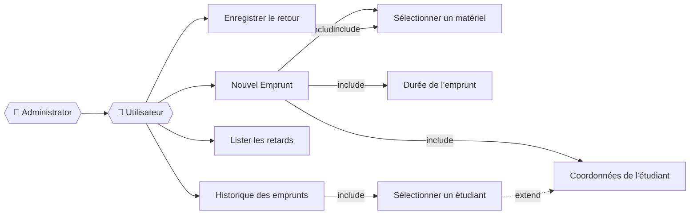

## cas d'utilisation

```mermaid
graph LR
  Administrator{{"👤 Administrator"}} --> Utilisateur{{"👤 Utilisateur"}}
  Utilisateur --> NouvelEmprunt["Nouvel Emprunt"]
  NouvelEmprunt --> |include| Matériel["Sélectionner un matériel"]
  NouvelEmprunt --> |include| Etudiant["Coordonnées de l’étudiant"]
  NouvelEmprunt --> |include| Durée["Durée de l’emprunt"]
  Utilisateur --> Historique["Historique des emprunts"]
  Historique --> |include| EtudiantSelectionner["Sélectionner un étudiant"]
  EtudiantSelectionner -.-> |extend| Etudiant
  Utilisateur --> Retards["Lister les retards"]
  Utilisateur --> Retour["Enregistrer le retour"]
  Retour --> |include| Matériel
```
