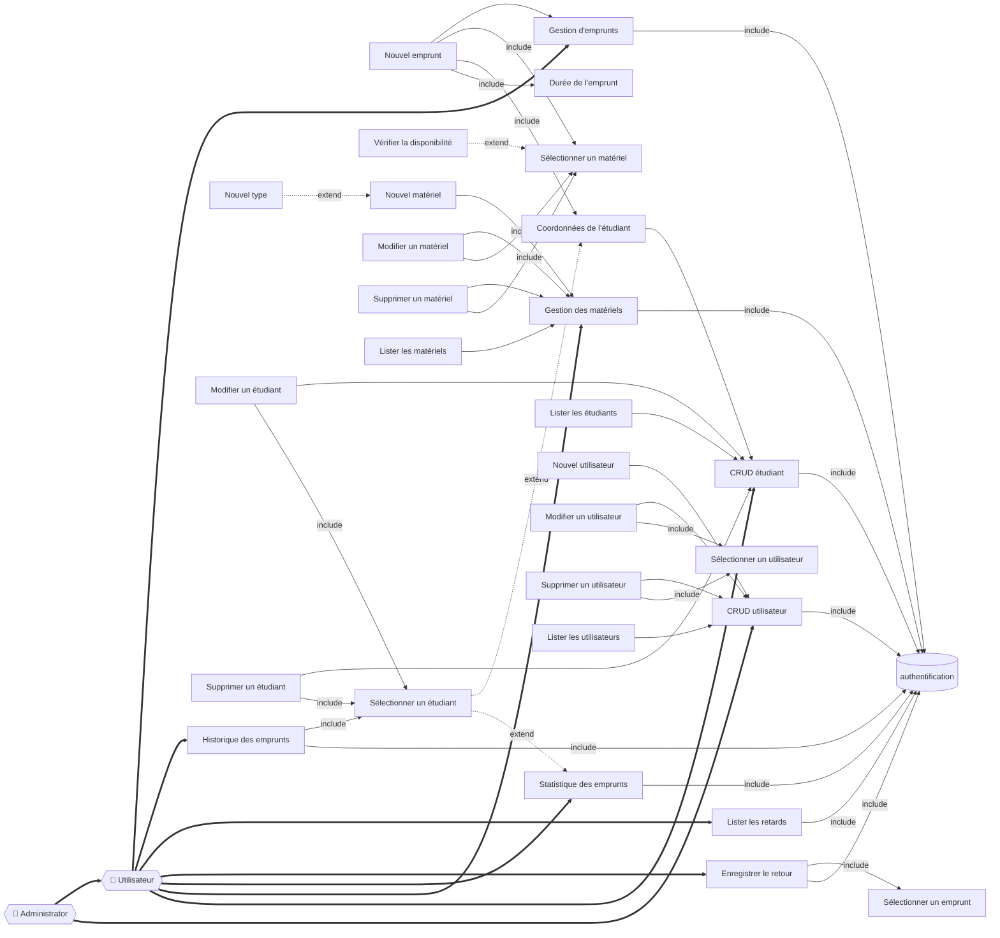
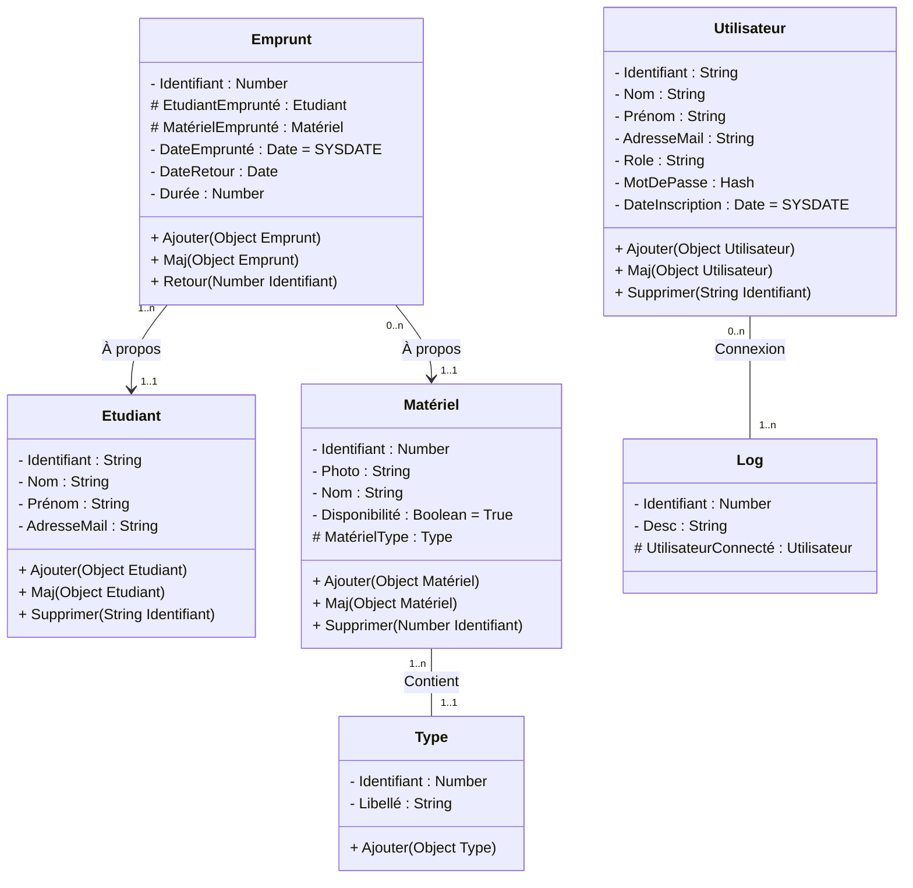

## cas d'utilisation

```mermaid
graph LR
  Administrator{{"👤 Administrator"}} ==> Utilisateur{{"👤 Utilisateur"}}
  Utilisateur ==> GestionEmprunts["Gestion d'emprunts"]
  NouvelEmprunt["Nouvel emprunt"] --> GestionEmprunts
  NouvelEmprunt --> |include| Matériel["Sélectionner un matériel"] 
  NouvelEmprunt --> |include| Coordonnées["Coordonnées de l’étudiant"] 
  NouvelEmprunt --> |include| Durée["Durée de l’emprunt"]
  Utilisateur ==> Historique["Historique des emprunts"]
  Historique --> |include| Etudiant["Sélectionner un étudiant"]
  Etudiant -.-> |extend| Coordonnées
  Utilisateur ==> Retards["Lister les retards"]
  Utilisateur ==> Retour["Enregistrer le retour"]
  Retour --> |include| Emprunt["Sélectionner un emprunt"]
  Disponibilité["Vérifier la disponibilité"] -.-> |extend| Matériel
  Utilisateur ==> Statistique["Statistique des emprunts"]
  Etudiant -.-> |extend| Statistique
  Utilisateur ==> CrudMatériel["Gestion des matériels"]
  NouvelMatériel["Nouvel matériel"] --> CrudMatériel
  NouvelType["Nouvel type"] -.-> |extend| NouvelMatériel
  ModifierMatériel["Modifier un matériel"] --> CrudMatériel
  ModifierMatériel --> |include| Matériel
  SupprimerMatériel["Supprimer un matériel"] --> CrudMatériel
  SupprimerMatériel --> |include| Matériel
  ListerMatériels["Lister les matériels"] --> CrudMatériel
  Utilisateur ==> CrudEtudiant["CRUD étudiant"]
  Coordonnées --> CrudEtudiant
  ModifierEtudiant["Modifier un étudiant"] --> CrudEtudiant
  ModifierEtudiant --> |include| Etudiant
  SupprimerEtudiant["Supprimer un étudiant"] --> CrudEtudiant
  SupprimerEtudiant --> |include| Etudiant
  ListerEtudiants["Lister les étudiants"] --> CrudEtudiant
  Administrator ==> CrudUtilisateur["CRUD utilisateur"]
  NouvelUtilisateur["Nouvel utilisateur"] --> CrudUtilisateur
  ModifierUtilisateur["Modifier un utilisateur"] --> CrudUtilisateur
  ModifierUtilisateur --> |include| SUtilisateur["Sélectionner un utilisateur"]
  SupprimerUtilisateur["Supprimer un utilisateur"] --> CrudUtilisateur
  SupprimerUtilisateur --> |include| SUtilisateur
  ListerUtilisateurs["Lister les utilisateurs"] --> CrudUtilisateur
  
  GestionEmprunts & Historique & Retards & Retour & Statistique & CrudMatériel & CrudEtudiant & CrudUtilisateur --> |include| Authentification[(authentification)]
```
## classes

```mermaid
classDiagram
    class Etudiant {
        - Identifiant : String
        - Nom : String
        - Prénom : String
        - AdresseMail : String
        + Ajouter(Object Etudiant)
        + Maj(Object Etudiant)
        + Supprimer(String Identifiant)
    }
    class Type {
        - Identifiant : Number
        - Libellé : String
        + Ajouter(Object Type)
    }
    class Matériel {
        - Identifiant : Number
        - Photo : String
        - Nom : String
        - Disponibilité : Boolean = True
        # MatérielType : Type
        + Ajouter(Object Matériel)
        + Maj(Object Matériel)
        + Supprimer(Number Identifiant)
    }
    class Emprunt {
        - Identifiant : Number
        # EtudiantEmprunté : Etudiant
        # MatérielEmprunté : Matériel
        - DateEmprunté : Date = SYSDATE
        - DateRetour : Date
        - Durée : Number
        + Ajouter(Object Emprunt)
        + Maj(Object Emprunt)
        + Retour(Number Identifiant)
    }
    class Utilisateur {
        - Identifiant : String
        - Nom : String
        - Prénom : String
        - AdresseMail : String
        - Role : String
        - MotDePasse : Hash
        - DateInscription : Date = SYSDATE
        + Ajouter(Object Utilisateur)
        + Maj(Object Utilisateur)
        + Supprimer(String Identifiant)
    }
    class Log {
        - Identifiant : Number
        - Desc : String
        # UtilisateurConnecté : Utilisateur
    }
    
    Matériel "1..n" -- "1..1" Type : Contient
    Emprunt "0..n" --> "1..1" Matériel : À propos
    Emprunt "1..n" --> "1..1" Etudiant : À propos
    Utilisateur "0..n" -- "1..n" Log : Connexion
```
