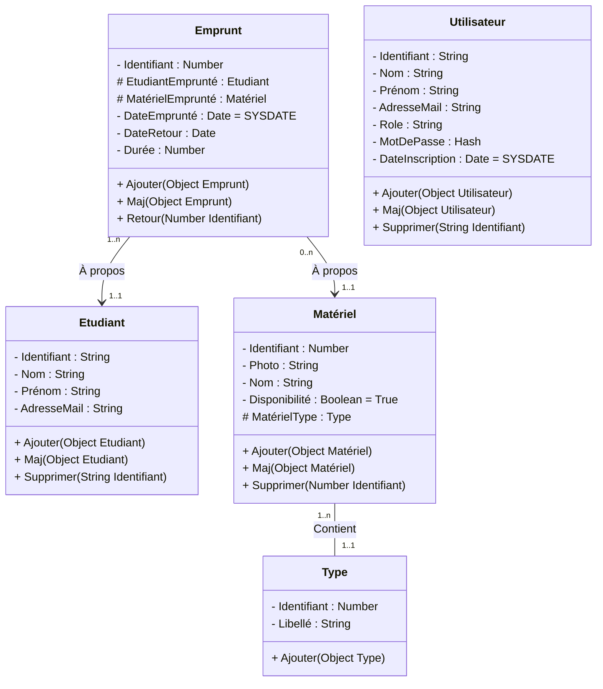

## cas d'utilisation
```mermaid
graph LR
  Administrator{{"👤 Administrator"}} --> Utilisateur{{"👤 Utilisateur"}}
  Utilisateur --> NouvelEmprunt["Nouvel emprunt"]
  NouvelEmprunt --> |include| Matériel["Sélectionner un matériel"]
  NouvelEmprunt --> |include| Coordonnées["Coordonnées de l’étudiant"]
  NouvelEmprunt --> |include| Durée["Durée de l’emprunt"]
  Utilisateur --> Historique["Historique des emprunts"]
  Historique --> |include| Etudiant["Sélectionner un étudiant"]
  Etudiant -.-> |extend| Coordonnées
  Utilisateur --> Retards["Lister les retards"]
  Utilisateur --> Retour["Enregistrer le retour"]
  Retour --> |include| Emprunt["Sélectionner un emprunt"]
  Disponibilité["Vérifier la disponibilité"] -.-> |extend| Matériel
  Utilisateur --> Statistique["Statistique des emprunts"]
  Etudiant -.-> |extend| Statistique
  Utilisateur --> CrudMatériel["CRUD matériel"]
  CrudMatériel <|-- NouvelMatériel["Nouvel matériel"]
  NouvelType["Nouvel type"] -.-> |extend| NouvelMatériel
  CrudMatériel <|-- ModifierMatériel["Modifier un matériel"]
  ModifierMatériel --> |include| Matériel
  CrudMatériel <|-- SupprimerMatériel["Supprimer un matériel"]
  SupprimerMatériel --> |include| Matériel
  CrudMatériel <|-- ListerMatériels["Lister les matériels"]
  Utilisateur --> CrudEtudiant["CRUD étudiant"]
  CrudEtudiant <|-- Coordonnées
  CrudEtudiant <|-- ModifierEtudiant["Modifier un étudiant"]
  ModifierEtudiant --> |include| Etudiant
  CrudEtudiant <|-- SupprimerEtudiant["Supprimer un étudiant"]
  SupprimerEtudiant --> |include| Etudiant
  CrudEtudiant <|-- ListerEtudiants["Lister les étudiants"]
  Administrator --> CrudUtilisateur["CRUD utilisateur"]
  CrudUtilisateur <|-- NouvelUtilisateur["Nouvel utilisateur"]
  CrudUtilisateur <|-- ModifierUtilisateur["Modifier un utilisateur"]
  ModifierUtilisateur --> |include| SUtilisateur["Sélectionner un utilisateur"]
  CrudUtilisateur <|-- SupprimerUtilisateur["Supprimer un utilisateur"]
  SupprimerUtilisateur --> |include| SUtilisateur
  CrudUtilisateur <|-- ListerUtilisateurs["Lister les utilisateurs"]
```
## classes

